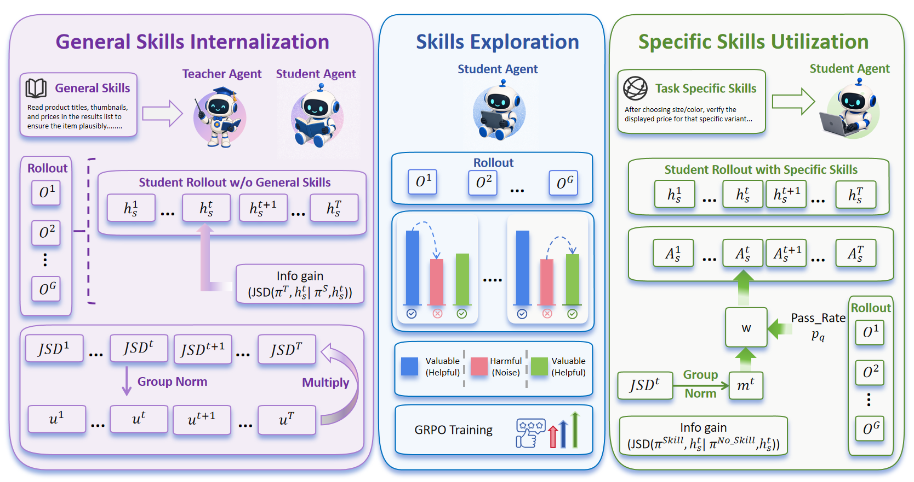
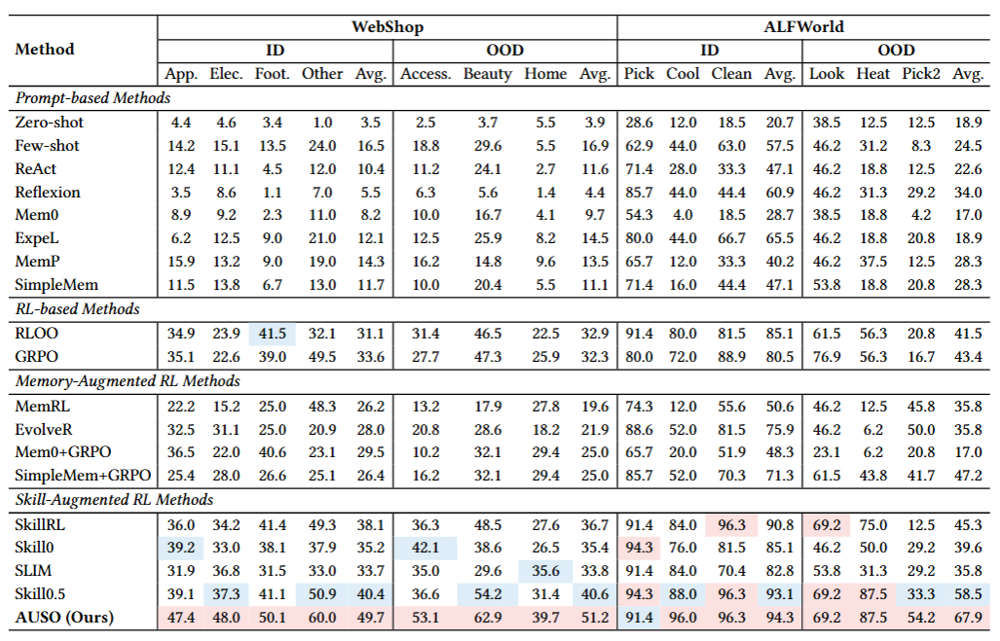

# AUSO: Action-Level Unified Skill Optimization from Internalization to Utilization

## Overview

Existing skill-based RL methods rely on **coarse trajectory-level routing** to separate skill internalization and utilization, overlooking that skill guidance may affect individual actions differently. **AUSO (Action-Level Unified Skill Optimization)** unifies both at the **action level**, using JSD-based information gain to quantify how strongly skills influence each decision.

<div align="center">
  
</div>

AUSO follows a progressive skill lifecycle:

* **Internalization**: distill general skills with action-level information-gain guidance.
* **Exploration**: develop autonomous problem-solving ability via GRPO.
* **Utilization**: adaptively optimize task-specific skill utilization according to action-level information gain.

Throughout training, skills evolve from **external supervision → autonomous exploration → information-gain-guided utilization**, while GRPO remains the shared optimization backbone.

Experiments on **ALFWorld, WebShop, and Search-QA** demonstrate consistent improvements over strong skill-based RL baselines, particularly in OOD generalization.

<div align="center">
  
</div>


---

## Installation

### Python Environment

```bash
conda create -n AUSO python=3.12 -y
conda activate AUSO

pip install vllm==0.11.0
pip install flash-attn==2.7.4.post1 --no-build-isolation --no-cache-dir
pip install -e .

pip install openai
```

### Environment Setup

#### ALFWorld

```bash
pip install alfworld
pip install gymnasium==0.29.1
pip install stable-baselines3==2.6.0

# Download PDDL & Game files and pre-trained MaskRCNN detector
alfworld-download -f
```

#### WebShop

```bash
cd agent_system/environments/env_package/webshop
./setup.sh -d all
```

#### Search-QA

Install the Search environment dependencies:

```bash
pip install -e ".[search]"
conda install -c pytorch -c nvidia faiss-gpu -y
```

The runtime expects this unified directory layout:

```text
search_data/
├── e5_Flat.index
├── wiki-18.jsonl
└── text/
    ├── train.parquet
    ├── test.parquet
    └── val.parquet       
```

The preprocessing step writes only the combined `test.parquet` and
`val.parquet` files. Training uses the smaller combined `val.parquet`, while `eval_search_qa.sh` evaluates the
full combined `test.parquet`.

The retriever uses an E5 encoder and a FAISS Wikipedia index. Download and
assemble the index (this is a large artifact, so keep it outside the repo):

```bash
python examples/search/searchr1_download.py --local_dir "search_data"
```

Start the retrieval service in a separate terminal. The default endpoint is
`http://127.0.0.1:8030/retrieve`.

```bash
export SEARCH_DATA="$PWD/search_data"
bash examples/search/retriever/retrieval_launch.sh
```

Check that the service is responding:

```bash
curl -X POST http://127.0.0.1:8030/retrieve \
  -H "Content-Type: application/json" \
  -d '{"query":"Who wrote The Old Man and the Sea?","topk":3}'
```

---

## Data Preparation

### WebShop OOD Splits

Before training on WebShop, generate the OOD category splits:

```bash
python -m data_preprocess.preprocess_webshop_ood \
    --human_goals_path agent_system/environments/env_package/webshop/webshop/data/items_ins_v2_human.json \
    --items_path agent_system/environments/env_package/webshop/webshop/data/items_shuffle_human.json \
    --output data_preprocess/webshop_ood_splits.json
```

This produces `webshop_ood_splits.json` containing the ID/OOD goal indices used during training and evaluation.

### Embedding Model

The skill retrieval system uses [Qwen3-Embedding-0.6B](https://huggingface.co/Qwen/Qwen3-Embedding-0.6B) for semantic similarity. It will be downloaded automatically from HuggingFace on first use, or you can pre-download it:

```bash
huggingface-cli download Qwen/Qwen3-Embedding-0.6B --local-dir /path/to/Qwen3-Embedding-0.6B
```

Then pass the local path via `+env.skills_only_memory.embedding_model_path=/path/to/Qwen3-Embedding-0.6B` in the training script.

### Search-QA Data

The default preparation command downloads the NQ + HotpotQA Search-R1 data,
normalizes its answer fields, assigns Skill0.5 task categories, and produces a
balanced validation parquet:

```bash
export SEARCH_DATA="$PWD/search_data"
bash scripts/prepare_search_qa.sh
```

If you downloaded the dataset manually, place the two original files at
`search_data/raw/train.parquet` and
`search_data/raw/test.parquet`, then process without network access:

```bash
export SEARCH_DATA="$PWD/search_data"
export SEARCH_QA_RAW_DIR="$SEARCH_DATA/raw"
bash scripts/prepare_search_qa.sh
```

Likewise, manually downloaded `part_aa`, `part_ab`, and
`wiki-18.jsonl.gz` can be placed under `search_data/` and assembled
offline:

```bash
python examples/search/searchr1_download.py \
  --local_dir search_data \
  --offline
```

For a small pipeline smoke run:

```bash
MAX_TRAIN_SAMPLES=128 MAX_TEST_SAMPLES=64 \
  VAL_SAMPLES_PER_GROUP=16 \
  bash scripts/prepare_search_qa.sh
```

The default Hugging Face repository contains NQ and HotpotQA. A custom
Search-R1-compatible repository can be selected with `SEARCH_QA_REPO`; source
labels such as TriviaQA, PopQA, 2WikiMultiHopQA, MuSiQue, and Bamboogle are
also accepted by the reward and skill-category adapters.

---

## Training

All training scripts are under `scripts/` and assume the repo root as working directory.

### ALFWorld OOD

```bash
export MODEL_PATH=/path/to/Qwen2.5-7B-Instruct
export ALFWORLD_DATA=/path/to/alfworld_data

bash scripts/train_alfworld_ood.sh
```

### WebShop OOD

```bash
export MODEL_PATH=/path/to/Qwen2.5-7B-Instruct
export WEBSHOP_DATA=/path/to/webshop_data

bash scripts/train_webshop_ood.sh
```

### Search-QA

Keep the retrieval service running, then train from the repository root:

```bash
export MODEL_PATH=/path/to/Qwen2.5-7B-Instruct
export SEARCH_DATA="$PWD/search_data"
bash scripts/train_search_qa.sh vllm
```
---
## Hardware

```text
All experiments are conducted on a server equipped with 4 NVIDIA H200 GPUs
```

---

## Acknowledgement

This project builds on [SkillRL](https://github.com/aiming-lab/SkillRL), [Skill0](https://github.com/ZJU-REAL/SkillZero), [Skill0.5](https://github.com/JasonZhujp/Skill0_5), [verl](https://github.com/volcengine/verl), [verl-agent](https://github.com/langfengQ/verl-agent), [ALFWorld](https://github.com/alfworld/alfworld), [WebShop](https://github.com/princeton-nlp/WebShop) and [Search-R1](https://github.com/PeterGriffinJin/Search-R1). We thank the authors of those projects.
